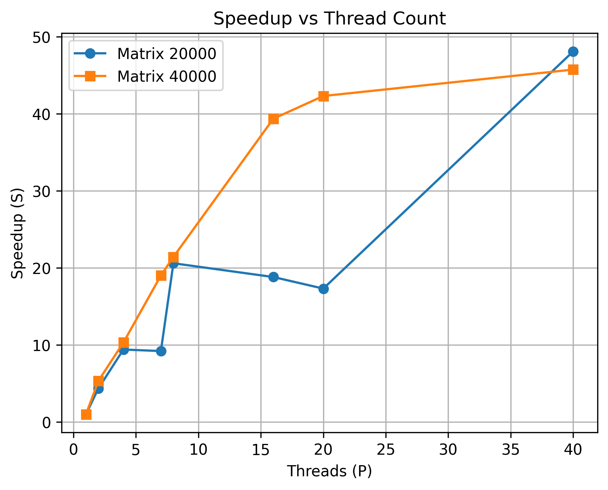

Multi-threaded matrix-vector product.

# Build 

```
    make
```

# Run

```
    # Enter the number of threads and the size of quadratic matrix.
    ./dgemv num_threads matrix_size
```

Use `make clean` to remove the executable file.

# Report

## Node description

```
    Model name:                     Intel(R) Xeon(R) Gold 6248 CPU @ 2.50GHz
    CPU(s):                         80

    Server name:                    ProLiant XL270d Gen10
                    
    NUMA node(s):                   2
    NUMA node0 CPU(s):              0-19,40-59
    NUMA node1 CPU(s):              20-39,60-79

    node 0 size:                    385636 MB
    node 0 free:                    105947 MB

    node 1 size:                    387008 MB
    node 1 free:                    232013 MB

    OS:                             Ubuntu 22.04.5 LTS
```

## Scaling

<table style="text-align: center;"><thead>
  <tr style="background-color:rgb(235, 235, 235);">
    <th rowspan="3">Matrix size<br>(M=N)</th>
    <th colspan="15">Thread amount</th>
  </tr>
  <tr style="background-color:rgb(235, 235, 235);">
    <th>1</th>
    <th colspan="2">2</th>
    <th colspan="2">4</th>
    <th colspan="2">7</th>
    <th colspan="2">8</th>
    <th colspan="2">16</th>
    <th colspan="2">20</th>
    <th colspan="2">40</th>
  </tr>
  <tr style="background-color:rgb(235, 235, 235);">
    <th>T(1), s</th>
    <th>T(2), s</th>
    <th>S(2)</th>
    <th>T(4), s</th>
    <th>S(4)</th>
    <th>T(7), s</th>
    <th>S(7)</th>
    <th>T(8), s</th>
    <th>S(8)</th>
    <th>T(16), s</th>
    <th>S(16)</th>
    <th>T(20), s</th>
    <th>S(20)</th>
    <th>T(40), s</th>
    <th>S(40)</th>
  </tr></thead>
<tbody>
  <tr>
    <th style="background-color:rgb(235, 235, 235);">20000<br>(~3 GiB)</th>
    <td>~4.33</td>
    <td>~0.99</td>
    <td>~4.37</td>
    <td>~0.46</td>
    <td>~9.41</td>
    <td>~0.47</td>
    <td>~9.21</td>
    <td>~0.21</td>
    <td>~20.61</td>
    <td>~0.23</td>
    <td>~18.82</td>
    <td>~0.25</td>
    <td>~17.32</td>
    <td>~0.09</td>
    <td>~48.11</td>
  </tr>
  <tr>
    <th style="background-color:rgb(235, 235, 235);">40000<br>(~12 GiB)</th>
    <td>~16.93</td>
    <td>~3.16</td>
    <td>~5.35</td>
    <td>~1.64</td>
    <td>~10.32</td>
    <td>~0.89</td>
    <td>~19.02</td>
    <td>~0.79</td>
    <td>~21.43</td>
    <td>~0.43</td>
    <td>~39.37</td>
    <td>~0.40</td>
    <td>~42.32</td>
    <td>~0.37</td>
    <td>~45.75</td>
  </tr>
</tbody></table>

## Conclusion on thread usage

By using threads, the scaling works effectively. As we pass the vector initializing to a number of threads, we can see the increasing speedup, even though its effect decreases when the possibilities of the hardware are reached.

