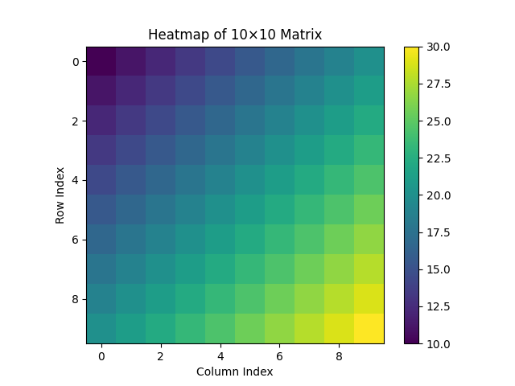

Heat equation solving by using Jacobi iteration with Linf-norm error calculation.

This code implements CUDA.



[**Click here to open the report.**](https://docs.google.com/document/d/1NvmNHmlJHrfucx5kziFX4y-4M0REZIcQFdnA6FpSgqc/edit?usp=sharing)

# Build

```
    scripts/build.sh
```

# Run

```
    scripts/run.sh 512 1e-6 1000000

    # To make your own visualized matrix.
    # Make sure you have numpy and matplotlib installed.
    scripts/run.sh 10 1e-6 1000
    python3 show_matrix.py
```

# Generate Nsight Systems report

```
    scripts/clean.sh
    scripts/build.sh
    nsys profile --trace=cuda,openacc --force-overwrite true -o heat2d_report ./build/heat2d --size 256 --tol 1e-6 --max-iter 10000

    # To print in CLI
    nsys stats heat2d_report.nsys-rep

    # To open in GUI
    nsys-ui heat2d_report.nsys-rep
```

# Clean

```
    scripts/clean.sh
```